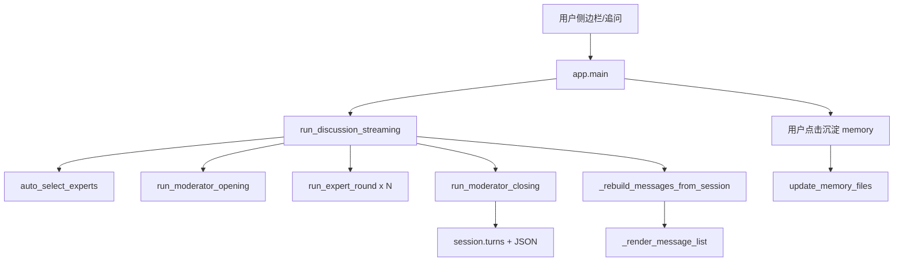

# 架构说明

> 最后更新：2026-05-26 · 对应 commit `d9f80aa`

## 项目定位（一句话）

**面向产品经理的 AI 专家圆桌系统**：用户输入需求/追问，多位虚拟专家轮流发言，主持人收场输出固定三行小结，并可手动沉淀到 Markdown 长期记忆。

## 技术栈

| 层级 | 技术 |
|------|------|
| UI | Streamlit 1.40（`streamlit run app.py`） |
| LLM | LangChain + OpenAI 兼容 API（DeepSeek 默认，见 `core/llm.py`） |
| 专家编排 | 自研 `roundtable/`（非 CrewAI 主路径） |
| 会话持久化 | JSON 文件 `memory/sessions/{session_id}.json` |
| 长期记忆 | Markdown 文件 `memory/*.md`（非向量库） |
| 图片输入 | pytesseract OCR（`session.extract_text_from_image_bytes`） |
| CLI 入口 | `main.py`（报告/PRD 生成，与 Streamlit 并行存在） |

**当前阶段未接入**：ChromaDB / 向量 RAG、自动写入 memory（仅按钮触发）。

## 目录结构与职责

```
pm-insight-agent/
├── app.py                 # Streamlit 主界面：多轮追问、消息渲染、小结去重、memory 按钮
├── main.py                # CLI：需求分析 + 圆桌报告 + PRD
├── project_context.md     # 项目背景（注入专家 prompt）
├── requirements.txt
├── .env / .env.example    # API Key、LLM_PROVIDER
│
├── core/
│   ├── llm.py             # get_llm、check_api_key
│   ├── utils.py           # read_project_context 等
│   └── report.py          # 报告文件读写
│
├── roundtable/
│   ├── discussion.py      # 专家发言、主持人开/收场、文本清洗、force_summary_markdown
│   ├── session.py         # RoundtableSession、turns、save/load、OCR
│   ├── synthesis.py       # 报告合成、PRD、update_memory_files（upsert）
│   ├── moderator.py       # 打断分类、阶段性小结（CLI 遗留，app 主流程用 discussion）
│   ├── expert_selector.py # auto_select_experts
│   ├── agent_loader.py    # 加载专家 YAML/配置 → ExpertAgent
│   └── agent_registry.py  # AgentRegistry 分类检索
│
├── memory/
│   ├── insights.md / decisions.md / todos.md / open_questions.md
│   ├── sessions/*.json    # 每轮讨论完整存档
│   └── memory_loader.py   # 记忆加载（供 prompt 使用）
│
└── docs/                  # 会话交接文档（本目录）
```

## 核心数据流



## 关键模块 API（精简）

### `app.py`

| 函数 | 职责 |
|------|------|
| `run_discussion_streaming` | 一轮完整讨论；结束时 `messages = _rebuild_messages_from_session` + `rerun` |
| `_render_message_list` | 静态渲染历史；summary 用 `normalized_content = force_summary_markdown(...)` |
| `_rebuild_messages_from_session` | 从 `session.turns` 全量重建，避免重复小结 |
| `_dedupe_summary_messages` | 连续小结只留最后一条并规范化 |
| `_turn_to_message` | turn → UI message dict；主持人总结 → `type=summary` |
| `_prepare_expert_panel` | 按 speaker_key 去重，默认 product+tech+growth，最多 4 人 |
| `_persist_to_long_term_memory` | 按钮触发 `update_memory_files` |

### `roundtable/discussion.py`

| 函数 | 职责 |
|------|------|
| `run_expert_round` | 单专家发言 → `polish_discussion_text` + 短发言限制 |
| `run_moderator_opening` | 代码拼接开场（不调 LLM） |
| `run_moderator_closing` | LLM JSON → `_build_summary_three_lines` → `add_turn(主持人（总结）)` |
| `force_summary_markdown` | 抽取字段 → 强制 `## 本轮小结` + 三行 bullet |
| `sanitize_discussion_text` | 错词替换、去重空行 |

### `roundtable/session.py`

| 类型/函数 | 职责 |
|-----------|------|
| `RoundtableSession` | turns、decisions、todos、open_questions |
| `add_turn` / `save_session` / `load_session` | 持久化 |
| `extract_text_from_image_bytes` | 附件 OCR |

### `roundtable/synthesis.py`

| 函数 | 职责 |
|------|------|
| `synthesize_roundtable_report` | 长报告生成 |
| `update_memory_files` | 按 session_id upsert 四个 md 文件 |
| `generate_prd_only` | PRD 初稿 |

### `roundtable/moderator.py`（次要）

| 函数 | 职责 |
|------|------|
| `classify_user_interruption` | 用户打断类型分类 |
| `generate_round_summary` | 旧版阶段性小结（`主持人小结` role） |

## Streamlit 状态字段

| `st.session_state` 键 | 含义 |
|------------------------|------|
| `messages` | UI 消息列表（dict：type/user/assistant/expert/summary） |
| `rt_session` | 当前 `RoundtableSession` |
| `rt_experts` / `rt_result` | 专家列表与选题结果 |
| `round_index` | 追问轮次 |
| `should_run_initial` / `should_run_followup` | 延迟到 rerun 后跑 LLM |
| `discussion_active` | 是否可追问 |
| `memory_saved` | 是否已沉淀 memory |

## 启动方式

```bash
streamlit run app.py
```

CLI：

```bash
python main.py
```
