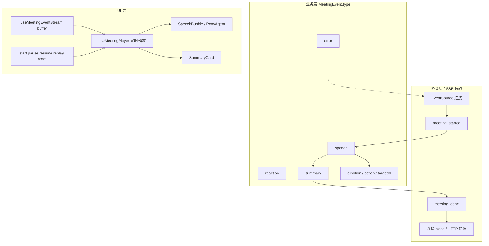
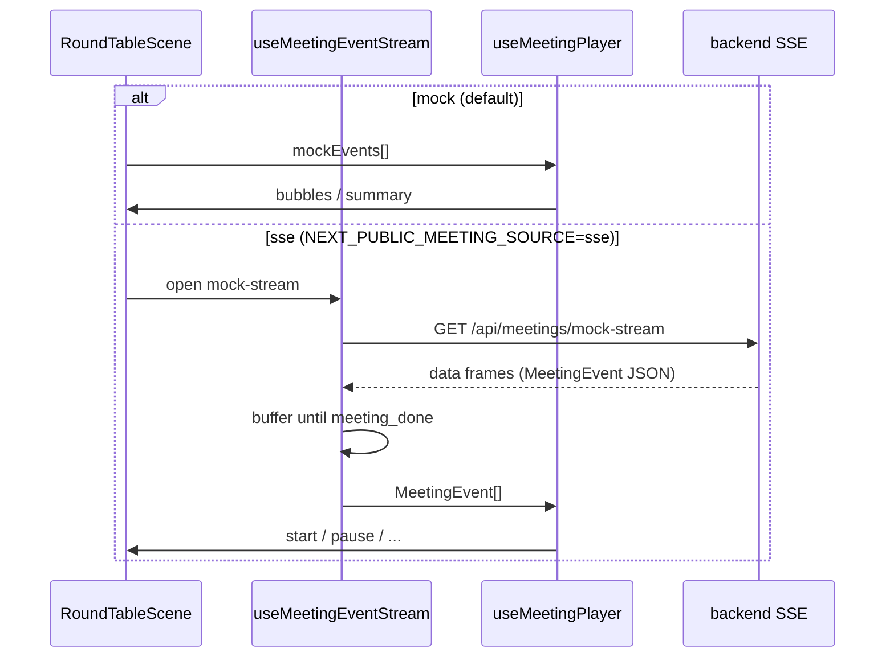

# 架构说明

> 最后更新：2026-05-27 · main `5d2bb24` · experiment 功能验收 `3360287`（tag `phase-2.1-pony-ui-accepted`）· 文档 HEAD `525cc93` · **Phase 2.2 Batch A（架构文档，backend/ 未创建）**

## 项目定位（一句话）

**面向产品经理的 AI 专家圆桌**：Streamlit 原型已封版；monorepo 内 **Next.js Pony UI（Phase 2.1 已验收）** 正接入 **独立 FastAPI mock SSE backend（Phase 2.2）**；远期由 `roundtable/` 经适配器产出真实 `MeetingEvent` 流（Phase 2.3+）。

## 技术栈

| 层级 | 技术 |
|------|------|
| 旧 UI | Streamlit 1.40（`app.py`，legacy bugfix only） |
| 新 UI | Next.js 16 + TypeScript + Tailwind + Framer Motion（`frontend/`） |
| Mock SSE API | FastAPI + uvicorn（**`backend/`**，Batch B+ 创建） |
| 事件契约（代码） | `frontend/lib/types.ts` |
| 事件契约（文档） | `docs/meeting-event-spec.md` |
| LLM | LangChain + OpenAI 兼容 API（`core/llm.py`，**不用于 Phase 2.2 mock**） |
| 业务逻辑 | `roundtable/`（Phase 2.2 **不 import**；2.3+ 适配） |
| 会话持久化 | JSON `memory/sessions/` |
| 长期记忆 | Markdown `memory/*.md`（非向量库） |
| CLI | `main.py`（与 Streamlit 并行） |

**未接入**：ChromaDB、真实 LLM orchestration over SSE、DB、鉴权、多用户会议状态。

## Phase 2.2 — Pony mock SSE 架构（Batch A 决策）

### 目录与隔离边界

| 决策 | 说明 |
|------|------|
| 服务目录 | 新建 **`backend/`**，独立 FastAPI 进程 |
| 不使用 | 顶层 `api/`、`app.py` 内 API、`roundtable/` 内 SSE、Next API Route 作为主 SSE 后端 |
| 与 legacy 隔离 | `backend/` **不** import `app.py` / `roundtable/`（Phase 2.2） |
| 不改 legacy | Phase 2.2 **不修改** `app.py`、`roundtable/` |
| 依赖 | **`backend/pyproject.toml`**（fastapi, uvicorn[standard], pydantic v2）；**不修改** 根 `requirements.txt` |

计划目录树见 `README_STRUCTURE.md`（Batch B/C 实施时创建，Batch A 仅文档）。

### 服务职责划分

**`backend/` 负责**

- FastAPI app、`GET /health`
- `GET /api/meetings/mock-stream`（SSE）
- `scenario` mock 数据（`backend/app/data/scenarios.py`）
- Pydantic 输出校验、开发环境 CORS

**`backend/` 不负责**

- 前端 `start` / `pause` / `resume` / `replay` / `reset`
- 真实 LLM、DB、多用户状态、鉴权、复杂断线重连

**`frontend/` 负责**

- 保留 `mockEvents` fallback/demo
- `useMeetingPlayer`：播放语义（不变）
- `useMeetingEventStream`（Batch E）：EventSource、JSON parse、buffer `MeetingEvent[]`、连接态
- Phase 2.2 MVP：**缓冲后播放**（收齐流 → 交给 `useMeetingPlayer`）

### 协议层 / 业务层 / UI 层



| 层 | 关注点 | 典型 `type` |
|----|--------|-------------|
| **协议 / 传输** | SSE 生命周期、流开始/结束 | `meeting_started`, `meeting_done`, 连接 close |
| **业务** | 可展示内容、决策结果 | `speech`, `reaction`, `summary`, `error` |
| **UI 播放** | 何时显示气泡/小结、用户控制 | `useMeetingPlayer` + 组件 |

**必须区分**

- `summary`：业务层「本轮决策」载荷（`SummaryCard`）。
- `meeting_done`：协议层「事件流结束」信号。
- **`summary` ≠ `meeting_done`。**

推荐 mock 顺序：`meeting_started` → `speech`/`reaction`… → `summary` → `meeting_done` → close。

### Mock 数据策略

- Phase 2.2：Python 字典于 `backend/app/data/scenarios.py`（**非** JSON 单一源、**非** TS 自动生成）。
- 文案手工对齐 `frontend/lib/mockEvents.ts`、`mockScenarios.ts`；存在 **TS/Python 漂移风险**（文档与 review 约束）。
- `weak` scenario 后续可含边界 case，用于 UI 压力测试。
- `mock_stream.py` 须含醒目注释：**THIS IS A MOCK** — 真实 orchestration 归入 Phase 2.3+ 独立 service 模块。

### 本地开发与 CORS

| 服务 | 端口 |
|------|------|
| `frontend` (`npm run dev`) | 3000 |
| `backend` (uvicorn) | 8000 |

- CORS allow：`http://localhost:3000`、`http://127.0.0.1:3000` only（**不用** `*`）。
- Phase 2.2 无鉴权；`EventSource` 无法带自定义 header（已知限制）。
- Windows 验收：`curl.exe -N`（见 Batch D 文档）。

### Pony 双数据源数据流（Phase 2.2 目标）



### Phase 2.2 实施批次（摘要）

| Batch | 内容 |
|-------|------|
| A | 架构决策文档（本批） |
| B | FastAPI 骨架 + `/health` + `backend/README` |
| C | mock-stream + scenarios + tests |
| D | SSE 调试 / 双端口联调文档 |
| E | `useMeetingEventStream`（buffer 模式） |
| F1 | `NEXT_PUBLIC_MEETING_SOURCE` + E2E |
| 2.2.1 / F2 | dev-only source/scenario UI 切换 |

详见 `docs/handoff.md`、`docs/progress.md`。

## 完整结构树

详见 **`docs/handoff.md`** 中的「项目文件结构树」与「模块关系图」（供 AI 评估用）。

## 目录结构与职责

```
pm-insight-agent/
├── app.py                 # Streamlit 主界面：多轮追问、消息渲染、小结去重、memory 按钮
├── main.py                # CLI：需求分析 + 圆桌报告 + PRD
├── project_context.md     # 项目背景（注入专家 prompt）
├── requirements.txt
├── .env / .env.example    # API Key、LLM_PROVIDER
│
├── core/
│   ├── llm.py             # get_llm、check_api_key
│   ├── utils.py           # read_project_context 等
│   └── report.py          # 报告文件读写
│
├── roundtable/
│   ├── discussion.py      # 专家发言、主持人开/收场、文本清洗、force_summary_markdown
│   ├── session.py         # RoundtableSession、turns、save/load、OCR
│   ├── synthesis.py       # 报告合成、PRD、update_memory_files（upsert）
│   ├── moderator.py       # 打断分类、阶段性小结（CLI 遗留，app 主流程用 discussion）
│   ├── expert_selector.py # auto_select_experts
│   ├── agent_loader.py    # 加载专家 YAML/配置 → ExpertAgent
│   └── agent_registry.py  # AgentRegistry 分类检索
│
├── memory/
│   ├── insights.md / decisions.md / todos.md / open_questions.md
│   ├── sessions/*.json    # 每轮讨论完整存档
│   └── memory_loader.py   # 记忆加载（供 prompt 使用）
│
└── docs/                  # 会话交接文档（本目录）
```

## 核心数据流


## 关键模块 API（精简）

### `app.py`

| 函数 | 职责 |
|------|------|
| `run_discussion_streaming` | 一轮完整讨论；结束时 `messages = _rebuild_messages_from_session` + `rerun` |
| `_render_message_list` | 静态渲染历史；summary 用 `normalized_content = force_summary_markdown(...)` |
| `_rebuild_messages_from_session` | 从 `session.turns` 全量重建，避免重复小结 |
| `_dedupe_summary_messages` | 连续小结只留最后一条并规范化 |
| `_turn_to_message` | turn → UI message dict；主持人总结 → `type=summary` |
| `_prepare_expert_panel` | 按 speaker_key 去重，默认 product+tech+growth，最多 4 人 |
| `_persist_to_long_term_memory` | 按钮触发 `update_memory_files` |

### `roundtable/discussion.py`

| 函数 | 职责 |
|------|------|
| `run_expert_round` | 单专家发言 → `polish_discussion_text` + 短发言限制 |
| `run_moderator_opening` | 代码拼接开场（不调 LLM） |
| `run_moderator_closing` | LLM JSON → `_build_summary_three_lines` → `add_turn(主持人（总结）)` |
| `force_summary_markdown` | 抽取字段 → 强制 `## 本轮小结` + 三行 bullet |
| `sanitize_discussion_text` | 错词替换、去重空行 |

### `roundtable/session.py`

| 类型/函数 | 职责 |
|-----------|------|
| `RoundtableSession` | turns、decisions、todos、open_questions |
| `add_turn` / `save_session` / `load_session` | 持久化 |
| `extract_text_from_image_bytes` | 附件 OCR |

### `roundtable/synthesis.py`

| 函数 | 职责 |
|------|------|
| `synthesize_roundtable_report` | 长报告生成 |
| `update_memory_files` | 按 session_id upsert 四个 md 文件 |
| `generate_prd_only` | PRD 初稿 |

### `roundtable/moderator.py`（次要）

| 函数 | 职责 |
|------|------|
| `classify_user_interruption` | 用户打断类型分类 |
| `generate_round_summary` | 旧版阶段性小结（`主持人小结` role） |

## Streamlit 状态字段

| `st.session_state` 键 | 含义 |
|------------------------|------|
| `messages` | UI 消息列表（dict：type/user/assistant/expert/summary） |
| `rt_session` | 当前 `RoundtableSession` |
| `rt_experts` / `rt_result` | 专家列表与选题结果 |
| `round_index` | 追问轮次 |
| `should_run_initial` / `should_run_followup` | 延迟到 rerun 后跑 LLM |
| `discussion_active` | 是否可追问 |
| `memory_saved` | 是否已沉淀 memory |

## 启动方式

```bash
streamlit run app.py
```

CLI：

```bash
python main.py
```
