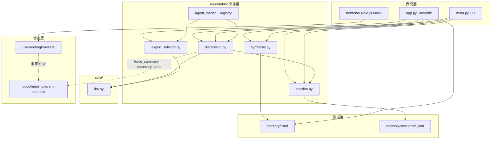

# AI 会话交接包

> **用途**：粘贴给新 AI / 外部评估者，用于**续接开发**或**方案评审**。  
> 维护方式：对 Cursor 说「更新交接包」→ 按 `.cursorrules` 刷新 `docs/`。

---

## 复制给新 AI 的提示词（从这里开始）

你是 **pm-insight-agent** 项目的续接开发者或方案评审 AI。请严格基于下列上下文工作，不要臆造未实现功能。

### 项目是什么（一句话）

**面向产品经理的 AI 专家圆桌**：用户提需求 → 多专家短发言 → 主持人固定三行小结 → 可追问 → 可沉淀长期记忆；正在从 **Streamlit 原型** 演进为 **小马 AI 风格 Next.js 前端 + 未来 FastAPI/SSE 后端** 的 monorepo。

### 当前 Git 锚点

| 分支 | 说明 | 锚点 |
|------|------|------|
| `main` | Streamlit Phase 1.5 **已封版** | `5d2bb24`，tag `phase-1.5-summary-done`，`DEBUG_SUMMARY=False` |
| `experiment/pony-roundtable-ui` | AI 专家圆桌演示 UI（**当前主开发线**） | **`654bd42`** · Phase 2.2 tag `phase-2.2-sse-mock-integration` 勿动 |

**Phase 2.1 tags（勿移动）**

| Tag | Commit | 含义 |
|-----|--------|------|
| `phase-2.1-pony-ui-polish` | `95fa3d6` | UI polish 完成点 |
| `phase-2.1-pony-ui-accepted` | `3360287` | **前端功能验收**；Pony UI 回滚锚点 |

**Phase 2.2 tags（勿移动）**

| Tag | Commit | 含义 |
|-----|--------|------|
| `phase-2.2-mock-sse-backend` | `741c181` | **仅后端** mock SSE 验收 |
| `phase-2.2-sse-mock-integration` | `905bee6` | **全链路** mock SSE integration 验收 |

> `6cb4ef9` = F1 env 接线 · `fa086f8` = SSE hook · `7e5620c` = Batch D 文档 · `741c181` = mock SSE backend。

### 当前阶段（2026-05-29）

```text
✅ Streamlit 圆桌 MVP 已封版（main，DEBUG 关）
✅ Phase 2.1 Pony 前端（tag phase-2.1-pony-ui-accepted @ 3360287）
✅ Phase 2.2 Mock SSE integration（tag phase-2.2-sse-mock-integration）
✅ Phase 2.3-Demo-LLM — scenario=llm + DeepSeek（见 handoff-phase-2.3-demo-llm.md）
✅ Phase 2.3-Demo-UI — 演示级 polish + 发言记录 + 分享材料（本提交）
   · 后端自动读根 .env 的 DEEPSEEK_*（backend/app/config.py）
   · LLM 议题由输入框传入（非 env 写死）
   · 专家角色统一中文名（主持人/产品/技术/增长），对齐 frontend mockEvents
   · 左侧 SpeechHistoryPanel 汇总全部发言、流式同步
   · 圆桌短气泡 ≤10 字；三列决策小结；玻璃拟态演示 UI
   · 分享文档：docs/ai-learning-share.{md,docx,pptx}
⏳ Phase 2.3+ — roundtable 编排 + 边生成边播（未开始）
⏳ reaction 有协议、无 UI；主 mock 无 reaction 事件
❌ ChromaDB / 向量 RAG 未接入
```

### 启动命令

| 目标 | 命令 | 端口 |
|------|------|------|
| 旧 Streamlit UI | `streamlit run app.py` | 8501 |
| Pony UI | `cd frontend && npm run dev` | 3000 |
| Mock SSE API | 见下方「Backend 启动」 | **8000** |
| CLI 报告/PRD | `python main.py` | — |

#### Backend 启动（Windows，Python 3.11+）

默认 `python` 若为 3.8，请用 **`py -3.12`**（与 `backend/README.md` 一致）：

```powershell
cd backend
py -3.12 -m pip install -e ".[dev]"
py -3.12 -m uvicorn app.main:app --reload --port 8000
```

健康检查（新进程应返回 `"sse":"mock_stream"`）：

```powershell
curl.exe http://127.0.0.1:8000/health
```

Mock SSE 流：

```powershell
curl.exe -N "http://127.0.0.1:8000/api/meetings/mock-stream?scenario=default&pace=1.0"
```

#### 双端口本地联调（Batch D）

| 终端 | 命令 | 验证 |
|------|------|------|
| 1 | `cd backend` → `py -3.12 -m uvicorn app.main:app --reload --port 8000` | `curl.exe http://127.0.0.1:8000/health` |
| 2 | `cd frontend` → `npm run dev`（默认 mock） | `http://localhost:3000` |
| 2b | SSE：`$env:NEXT_PUBLIC_MEETING_SOURCE="sse"` 后 `npm run dev` | 需终端 1 backend；缓冲完成后播放 |
| 2c | **Demo LLM**：`frontend/.env.local` 设 `NEXT_PUBLIC_MEETING_SOURCE=sse` + `SCENARIO=llm`；议题在页面输入框填写 | 需 backend；见下方 |

详见 `frontend/README.md`（`NEXT_PUBLIC_MEETING_*`）。**本地 LLM 演示推荐**用 `frontend/.env.local`（勿提交 git）。

#### Demo LLM 启动（评审会 / 分享演示）

**Backend**（自动读项目根 `.env` 的 `DEEPSEEK_*`，无需手动 `$env:`）

```powershell
cd backend
py -3.12 -m pip install -e ".[dev]"
py -3.12 -m uvicorn app.main:app --reload --port 8000
```

**Frontend**（`frontend/.env.local` 示例，勿提交）

```env
NEXT_PUBLIC_MEETING_SOURCE=sse
NEXT_PUBLIC_MEETING_SCENARIO=llm
NEXT_PUBLIC_MEETING_PACE=4.0
```

```powershell
cd frontend
npm run dev
```

浏览器：**http://localhost:3000** → 在输入框填议题 →「开始讨论」。

**旧方式（仍可用）**：手动 `$env:OPENAI_API_KEY` + `$env:NEXT_PUBLIC_MEETING_TOPIC=...`（见 `docs/handoff-phase-2.3-demo-llm.md`）。

说明：

- 先生成完整会议脚本，再经 SSE 播放 `MeetingEvent`；**非** token 级流式；**非** 完整多 Agent。
- 无 `OPENAI_API_KEY` 或 LLM 失败时，后端 **fallback** 本地脚本，仍正常 `meeting_done`。
- 修改 `NEXT_PUBLIC_*` 后需重启 frontend dev server。
- 默认 mock 仍不需 backend。

**演示备用议题**：AI 会不会取代产品经理 · 创业公司应该先追求增长还是利润 · 远程办公是否会降低团队创造力 · AI 圆桌会议能不能提升团队决策质量

**端口冲突**：若 8000 已被旧 uvicorn 占用（`[Errno 10048]`），先结束旧进程再启动，否则 `/health` 可能仍显示 `"sse":"not_implemented"` 且 mock-stream 404。

```powershell
# 查看占用（可选）
Get-NetTCPConnection -LocalPort 8000 -ErrorAction SilentlyContinue | Select-Object OwningProcess
```

#### Mock SSE curl 验收清单（已通过 @ `741c181`）

| 检查 | 命令 / 预期 |
|------|-------------|
| 流内容 | `curl.exe -N ".../mock-stream?scenario=default&pace=1.0"` 含 `"type":"meeting_started"`、`speech`、`summary`、`meeting_done` |
| 禁止项 | 输出中无 `event: speech`、无顶层 `"timestamp"` / `"metadata"` |
| `protocolVersion` | 仅 `meeting_started` 上出现 **`"1.0"`**（MeetingEvent 契约版本，≠ 项目 Phase 2.1） |
| 400 | `curl.exe -i "...?scenario=unknown"` |
| 422 | `curl.exe -i "...?pace=0.1"` 或 `pace=5` |
| pytest | `cd backend` → `py -3.12 -m pytest` → 15 passed |

#### Phase 2.2 Final 验收（F2 @ 2026-05-27）

| 检查 | 结果 |
|------|------|
| Integration commit（功能） | `6cb4ef9` |
| Final tag | `phase-2.2-sse-mock-integration` |
| Backend pytest | 15 passed |
| Frontend build / lint | passed |
| 默认 mock（无 `NEXT_PUBLIC_*`） | 原 UI；无 EventSource；不需 backend |
| SSE opt-in | `NEXT_PUBLIC_MEETING_SOURCE=sse` → 缓冲至 `closed` 后播放 |
| 边收边播 | 未实现 |
| Demo LLM (`scenario=llm`) | 已接入（演示版，见上） |

### 修改边界（评审/开发必守）

1. **`experiment/pony-roundtable-ui` 分支**：主改 `frontend/`、`docs/`；**不重构** `app.py`、`roundtable/`
2. **`main` 分支 Streamlit**：仅 bugfix，不大改 discussion 收场逻辑
3. 长期记忆：**仅按钮写入** `memory/*.md`，讨论中不自动写
4. 未来后端 SSE 必须兼容 `docs/meeting-event-spec.md` 的 `MeetingEvent`

### Phase 2.2 已交付（Accepted）

| 项 | 状态 |
|----|------|
| `backend/` mock SSE | ✅ `741c181` / tag `phase-2.2-mock-sse-backend` |
| `useMeetingEventStream` | ✅ `fa086f8` |
| `NEXT_PUBLIC_MEETING_SOURCE=mock\|sse` | ✅ `6cb4ef9`（默认 **mock**） |
| 缓冲后播放（非边收边播） | ✅ |
| 全链路验收 tag | ✅ `phase-2.2-sse-mock-integration` |

### 下一步 P0（Phase 2.3+）

1. `roundtable/discussion.py` → `MeetingEvent[]` 适配器
2. `force_summary_markdown` → `summary` 事件
3. Phase 2.3.1：专家文本强清洗

### 详细文档

- 架构：`docs/architecture.md`
- 进度：`docs/progress.md`
- 决策/坑：`docs/decisions.md`
- 事件协议：`docs/meeting-event-spec.md`
- Demo LLM：`docs/handoff-phase-2.3-demo-llm.md`
- **AI 学习分享**：`docs/ai-learning-share.md` · `docs/ai-learning-share.docx` · `docs/ai-learning-share.pptx`
- Monorepo 规则：`README_STRUCTURE.md`

---

## 项目文件结构树（带模块说明）

> 树中 `[技术]` = 主要技术栈，`[关联]` = 主要依赖/数据流向。  
> `agents_library/` 仅列顶层（内含大量第三方 agent markdown，非自研核心）。

```text
pm-insight-agent/                          # monorepo 根
│
├── app.py                                   # [Streamlit] 旧版 Web UI 主入口
│   │                                        # 职责：多轮追问、消息列表渲染、memory 按钮、OCR 附件
│   │                                        # [关联] → roundtable/*, core/llm, memory/
│   │                                        # 状态：legacy，仅 bugfix
│   │
├── main.py                                  # [Python CLI] 命令行圆桌 + 报告/PRD
│   │                                        # 职责：交互式讨论、SUMMARY/PRD/END 命令
│   │                                        # [关联] → roundtable/*, synthesis, moderator（CLI 路径）
│   │                                        # 状态：并行存在，非 Streamlit 主路径
│   │
├── project_context.md                       # [Markdown] 项目背景，注入专家 prompt
├── requirements.txt                         # [pip] Python 依赖（Streamlit, LangChain, pytesseract…）
├── README.md                                # 用户安装/运行说明
├── README_STRUCTURE.md                      # [文档] monorepo 目录归属与改动的硬性规则
├── .cursorrules                             # Cursor：「更新交接包」等自动化规则
├── .env / .env.example                      # LLM API Key、LLM_PROVIDER
│
├── core/                                    # Python 基础设施层
│   ├── llm.py                               # [LangChain/OpenAI 兼容] get_llm, check_api_key
│   │                                        # [关联] ← app.py, main.py, roundtable/*
│   ├── utils.py                             # read_project_context, 敏感词检查等
│   └── report.py                            # 报告文件读写（CLI output）
│
├── roundtable/                              # ★ 圆桌核心业务逻辑（Python，未来 backend 复用）
│   ├── discussion.py                        # 专家发言、主持人开/收场、文本清洗、force_summary_markdown
│   │                                        # [关联] ← app.run_discussion_streaming, main.py
│   │                                        # [技术] LLM prompt + JSON 收场 + 错词表
│   ├── session.py                           # RoundtableSession, turns, save/load JSON, OCR
│   │                                        # [关联] ← discussion, app, synthesis；→ memory/sessions/*.json
│   ├── synthesis.py                         # 长报告、PRD、update_memory_files（md upsert）
│   │                                        # [关联] ← app 沉淀按钮, main.py PRD
│   ├── expert_selector.py                   # auto_select_experts（LLM 选题 + discussion_plan）
│   │                                        # [关联] ← app.run_discussion_streaming
│   ├── agent_loader.py                      # 从 agents_library 加载 ExpertAgent
│   ├── agent_registry.py                    # AgentRegistry 分类检索
│   └── moderator.py                         # 打断分类、旧版阶段性小结（CLI 遗留，非 app 主路径）
│
├── memory/                                  # 持久化数据（非向量库）
│   ├── insights.md                          # 长期：一句话结论
│   ├── decisions.md                         # 长期：决策
│   ├── todos.md                             # 长期：待办
│   ├── open_questions.md                    # 长期：未决问题
│   ├── memory_loader.py                     # 加载 memory 注入 prompt
│   └── sessions/                            # 每轮讨论 JSON 存档（RoundtableSession 序列化）
│       └── YYYYmmdd_HHMMSS.json
│
├── docs/                                    # 产品与协议文档（可自由更新）
│   ├── handoff.md                           # ★ 本文件：AI 会话交接
│   ├── handoff-phase-2.3-demo-llm.md        # Demo LLM 专项交接
│   ├── ai-learning-share.md                 # 需求评审会 AI 学习分享（完整稿）
│   ├── ai-learning-share.docx               # 分享 Word（py scripts 生成）
│   ├── ai-learning-share.pptx               # 分享 PPT（py scripts 生成）
│   ├── ai-learning-share-ppt-outline.md     # PPT 大纲源
│   ├── architecture.md                      # 架构说明
│   ├── progress.md                          # 进度追踪
│   ├── decisions.md                         # 设计决策与已知坑
│   └── meeting-event-spec.md                # MeetingEvent 协议（前端 mock ↔ SSE 共用）
│
├── scripts/
│   ├── generate_share_docx.py               # 再生 ai-learning-share.docx
│   └── generate_share_pptx.py               # 再生 ai-learning-share.pptx
│
├── frontend/                                # ★ 新 UI（Next.js，experiment 分支主开发区）
│   ├── app/
│   │   ├── page.tsx                         # 入口 → RoundTableScene
│   │   ├── layout.tsx                       # 根布局、metadata（AI 专家圆桌）
│   │   └── globals.css                      # 渐变背景 + glass-panel 工具类
│   ├── components/
│   │   ├── RoundTableScene.tsx              # 主场景：圆桌 + 发言记录 + 输入 + 播放控制 + 议题徽章
│   │   ├── PonyAgent.tsx                    # 单角色头像、情绪环、speaking 动画、短气泡
│   │   ├── SpeechBubble.tsx                 # 短标签气泡（≤10 字互动）
│   │   ├── SpeechHistoryPanel.tsx           # ★ 左侧发言记录（全部专家、流式同步、自动滚动）
│   │   ├── MeetingInput.tsx                 # 议题输入（驱动 LLM topic）
│   │   └── SummaryCard.tsx                  # 三列决策小结卡片
│   ├── hooks/
│   │   ├── useMeetingPlayer.ts              # 事件播放状态机（含 activeIndex）
│   │   ├── useMeetingEventStream.ts         # SSE 缓冲拉流（scenario/topic 可覆盖）
│   │   ├── useSpeechHistory.ts              # 从播放进度派生发言记录列表
│   │   └── useStreamingText.ts              # 当前发言打字机效果
│   ├── lib/
│   │   ├── types.ts                         # MeetingEvent / AgentId 类型
│   │   ├── meeting-player.ts                # MeetingPlayer 接口
│   │   ├── meetingUi.ts                     # getShortBubbleText、emotion 样式
│   │   ├── meetingSource.ts                 # NEXT_PUBLIC_MEETING_* 解析
│   │   ├── speechHistory.ts                 # SpeechMessage 类型
│   │   ├── mockEvents.ts                    # 默认 mock（中文四专家）
│   │   └── mockScenarios.ts                 # concise / verbose / weak
│   ├── .env.local                           # 本地 SSE+LLM 配置（gitignore，勿提交）
│   └── package.json
│
├── agents_library/                          # 外部 agent 定义库（markdown persona）
│   └── agency-agents/                       # 按 design/engineering/marketing… 分类
│       └── …                                # [关联] → agent_loader.py 读取
│
├── output/                                  # CLI 生成的报告输出目录
│
└── backend/                                 # Phase 2.2 Batch B+ 创建；mock SSE only
                                             # Phase 2.2 不 import roundtable/
```

---

## 模块关系图（评估用）



---

## 双轨 UI 对照（评审重点）

| 维度 | Streamlit `app.py` | Next.js `frontend/` |
|------|-------------------|---------------------|
| 状态 | main 封版，legacy | experiment 分支，主开发 |
| 事件模型 | Python dict messages | `MeetingEvent` TS 类型 |
| 小结格式 | `force_summary_markdown` → markdown 三行 | `SummaryCard` direction/disagreement/nextStep |
| 播放 | 静态列表一次性渲染 | `useMeetingPlayer` + `useSpeechHistory` 定时播放 |
| 后端 | 进程内直接调 roundtable | `backend/` FastAPI mock SSE + Demo LLM |
| 用户议题 | 驱动 roundtable 讨论 | mock 模式固定脚本；**SSE+llm 模式输入框传 topic** |
| 迁移策略 | 保留至 backend 就绪 | UI 不动，换事件源；下一步接 roundtable 编排 |

---

## 核心函数速查

### app.py（Streamlit）

`run_discussion_streaming`, `_render_message_list`, `_rebuild_messages_from_session`, `_dedupe_summary_messages`, `_turn_to_message`, `_looks_like_summary_message`, `DEBUG_SUMMARY=False`

### roundtable/discussion.py

`run_expert_round`, `run_moderator_opening`, `run_moderator_closing`, `force_summary_markdown`, `sanitize_discussion_text`, `polish_discussion_text`

### frontend/hooks/useMeetingPlayer.ts

暴露：`currentEvent`, `currentEventId`, `activeIndex`, `summary`, `isPlaying`, `hasStarted`, `isComplete`, `start()`, `pause()`, `resume()`, `replay()`, `reset()`

**播放语义（Phase 2.1 已验收）**

| 方法 | 行为 |
|------|------|
| `start` | 从头开始播放 |
| `pause` | 暂停当前进度 |
| `resume` | 从暂停位置继续（非重头 `start`） |
| `replay` | 会议结束后重新播放，**不**回到输入态 |
| `reset` | 回到输入态，清空进度 |

---

## Phase 2.1 完成记录（Batch A–C + 验收 hotfix）

### 一、完成状态

- [x] Pony roundtable frontend mock
- [x] `MeetingEvent` 契约扩展（Batch A 文档 + Batch B 类型）
- [x] `MeetingPlayer` API 修正（pause / resume / replay / isComplete）
- [x] UI polish（emotion / action / target / SummaryCard / 移动端）
- [x] 本地验收 hotfix（Motion tween + 顶部气泡 placement）

### 二、关键提交

| Commit | 说明 |
|--------|------|
| `100ab73` | `docs: extend MeetingEvent spec and sync Phase 2.1 contract` |
| `9c7f236` | `feat(frontend): align MeetingEvent types and fix MeetingPlayer API` |
| `95fa3d6` | `feat(frontend): polish pony roundtable UI experience` |
| `3360287` | `fix(frontend): keep speech bubbles visible during playback` |

### 三、验收记录

- `npm run build` 通过
- `npm run dev` 本地浏览器验收通过
- 运行时修复：
  - Framer Motion：多 keyframe + spring/inertia 报错 → shake/bounce 改 `tween`
  - 顶部专家 `SpeechBubble` 被视口裁切 → `bubblePlacement="bottom"`（仅 `position: top` 角色）

### 四、当前功能要点

- 默认播放：`mockEvents.ts`（未改默认文案）
- 压力测试数据：`mockScenarios.ts`（`concise` / `verbose` / `weak`），UI 尚未切换入口
- `SpeechBubble`：emotion / action / `targetId` 关系行；顶部角色气泡向下展开
- speaking / targeted 高亮保留（`PonyAgent` ring + 虚线）

### 五、Phase 2.2 架构要点（Batch A 已写入文档）

详见 `docs/architecture.md`、`docs/decisions.md` §12、`docs/meeting-event-spec.md` SSE 节。

- **`backend/`** 独立服务；`backend/pyproject.toml`；不碰根 `requirements.txt`
- Mock 流：`meeting_started` → … → `summary` → `meeting_done` → close
- **`summary` ≠ `meeting_done`**
- 数据：`backend/app/data/scenarios.py` 手工对齐 TS（漂移风险已记录）

### 六、Phase 2.2 实施批次

| Batch | 状态 | 目标 |
|-------|------|------|
| **A** | ✅ `bf66604` | 架构决策文档 |
| **B** | ✅ `855efd9` | FastAPI 骨架 + `/health` |
| **C** | ✅ `741c181` + tag `phase-2.2-mock-sse-backend` | mock-stream + scenarios + tests |
| **D** | ✅ `7e5620c` | 联调 / 验收锚点文档 |
| **E** | ✅ `fa086f8` | `useMeetingEventStream`（buffer） |
| **F1** | ✅ `6cb4ef9` | `NEXT_PUBLIC_MEETING_SOURCE`（默认 mock） |
| **F2 / Final** | ✅ | 验收归档 + tag `phase-2.2-sse-mock-integration` |
| **2.2.1+** | ⏳ | dev-only source/scenario UI（后续） |
| **2.3-Demo-UI** | ✅ | 发言记录、演示 UI、DeepSeek 接线、分享材料 |

---

## Phase 2.3-Demo-UI 完成记录（2026-05-29）

### 一、完成状态

- [x] `backend/app/config.py` 自动读根 `.env` 的 `DEEPSEEK_*` → `OPENAI_*`
- [x] LLM 议题由 `RoundTableScene` 输入框 → `stream.start({ topic })`（修复答非所问）
- [x] `backend/app/services/llm_meeting.py` 专家角色改中文（对齐 `mockEvents.ts`）
- [x] `SpeechHistoryPanel` + `useSpeechHistory`：全部发言汇总、流式同步、自动滚动
- [x] 圆桌短气泡 `getShortBubbleText`（≤10 字）；`SpeechStreamPanel` 已移除
- [x] 演示 UI polish（玻璃卡片、状态徽章、议题徽章、三列 SummaryCard）
- [x] 分享材料：`docs/ai-learning-share.{md,docx,pptx}` + `scripts/generate_share_*`

### 二、关键提交（本阶段，按时间）

| Commit | 说明 |
|--------|------|
| `f6dba6e` | DeepSeek 接线 + 短气泡 + 流式面板 + LLM topic 修复 |
| `654bd42` | 发言记录 + 演示 UI + 中文专家 + 分享材料 + handoff 更新 |

### 三、演示要点

- 四专家名称**固定**（主持人/产品/技术/增长），换议题变的是**发言内容**
- 顶部显示「议题：xxx」徽章
- 左侧「发言记录」+ 圆桌短气泡 + 底部三列小结
- 分享：投屏 localhost:3000 或发 `ai-learning-share.docx` / `.pptx`（**勿发 localhost 链接**）

### 四、再生分享文档

```powershell
py -3.12 scripts/generate_share_docx.py
py -3.12 scripts/generate_share_pptx.py
```

---

## 已知注意事项

1. **`DEBUG_SUMMARY=False`**（main 已封版；勿在文档中写 True）
2. **`reaction`**：协议含此 type，**mock/UI 均未实现**（主 mock 无 reaction 事件）
3. **用户输入**：mock 模式仍播放固定 `mockEvents`；**SSE+llm 模式**输入框 topic 传给后端 LLM
4. **四专家名称固定**：UI 槽位不变；LLM 只改发言内容，不会按议题换角色名
5. **control events**：`meeting_started` / `meeting_done` / `error` 已在 hook 中处理
6. Mock 播放：`useMeetingPlayer`；SSE：`useMeetingEventStream`；发言记录：`useSpeechHistory`
7. **Phase 2.2+** `backend/` 已存在；**不改** `app.py` / `roundtable/` 主逻辑
8. Streamlit 勿用 `_render_messages` 动态重绘；memory 仅按钮写入
9. **Framer Motion**：多 keyframe 动画必须用 `tween`，勿对 3+ keyframe 使用 spring/inertia
10. **`frontend/.env.local`**：本地演示配置，已 gitignore；改后需重启 `npm run dev`
11. **Office 临时文件** `docs/~$*`：Word/PPT 打开时产生，勿提交

---

## 给方案评审 AI 的评估清单

1. **Monorepo 边界**是否合理？（`README_STRUCTURE.md`）
2. **MeetingEvent 协议**是否足够支撑 SSE 与 mock 对齐？
3. **useMeetingPlayer 隔离**是否利于后端接入而不重写 UI？
4. **roundtable/ 复用**路径是否清晰（discussion → API → SSE → frontend）？
5. **Streamlit 遗留**何时下线？建议：backend + SSE 跑通后再弃
6. **风险点**：专家文本质量、无向量记忆、双 UI 维护成本

---

*交接包版本：2026-05-29 Phase 2.3-Demo-UI @ `654bd42` · Phase 2.3-Demo-LLM `f6dba6e` · Phase 2.2 tags `phase-2.2-mock-sse-backend` + `phase-2.2-sse-mock-integration` · Phase 2.1 `phase-2.1-pony-ui-accepted` @ `3360287` · main @ `5d2bb24`*
