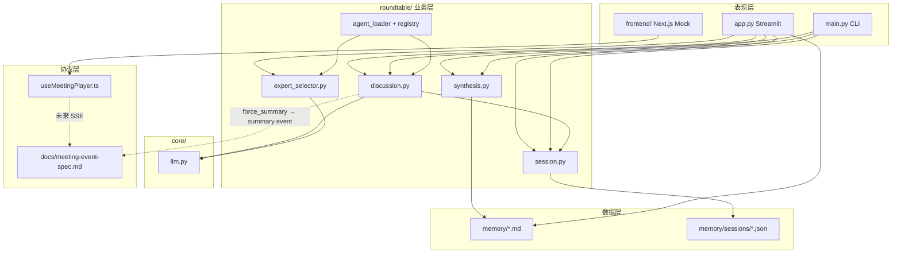

# AI 会话交接包

> **用途**：粘贴给新 AI / 外部评估者，用于**续接开发**或**方案评审**。  
> 维护方式：对 Cursor 说「更新交接包」→ 按 `.cursorrules` 刷新 `docs/`。

---

## 复制给新 AI 的提示词（从这里开始）

你是 **pm-insight-agent** 项目的续接开发者或方案评审 AI。请严格基于下列上下文工作，不要臆造未实现功能。

### 项目是什么（一句话）

**面向产品经理的 AI 专家圆桌**：用户提需求 → 多专家短发言 → 主持人固定三行小结 → 可追问 → 可沉淀长期记忆；正在从 **Streamlit 原型** 演进为 **小马 AI 风格 Next.js 前端 + 未来 FastAPI/SSE 后端** 的 monorepo。

### 当前 Git 锚点（以仓库 **HEAD** 为准）

| 分支 | 说明 | 锚点 |
|------|------|------|
| `main` | Streamlit Phase 1.5 **已封版** | `5d2bb24`，tag `phase-1.5-summary-done`，`DEBUG_SUMMARY=False` |
| `experiment/pony-roundtable-ui` | 小马圆桌（**当前主开发线**） | **`0713f93`** — `docs: 交接包增加项目结构树与模块关联说明` |

历史 tag：`phase-1.5-before-summary-render-final`（`d9f80aa`）。  
**文档漂移**：此前 handoff/progress 曾写 `27bdeff`，已在 Batch A（契约文档）中修正。

### 当前阶段（2026-05-27）

```text
✅ Streamlit 圆桌 MVP 已封版（main，DEBUG 关）
✅ Next.js Pony Mock（mockEvents + useMeetingPlayer）
✅ Batch A：meeting-event-spec 扩展 + docs 同步
⏳ Phase 2.1a 代码未开始（types / MeetingPlayer / hook 修复）
⏳ backend/ 未创建（至 Phase 2.2）
⏳ reaction 有协议、无 UI；control events 仅文档定义
❌ ChromaDB / 向量 RAG 未接入
```

### 启动命令

| 目标 | 命令 | 端口 |
|------|------|------|
| 旧 Streamlit UI | `streamlit run app.py` | 8501 |
| 新 Pony UI Mock | `cd frontend && npm run dev` | 3000 |
| CLI 报告/PRD | `python main.py` | — |

### 修改边界（评审/开发必守）

1. **`experiment/pony-roundtable-ui` 分支**：主改 `frontend/`、`docs/`；**不重构** `app.py`、`roundtable/`
2. **`main` 分支 Streamlit**：仅 bugfix，不大改 discussion 收场逻辑
3. 长期记忆：**仅按钮写入** `memory/*.md`，讨论中不自动写
4. 未来后端 SSE 必须兼容 `docs/meeting-event-spec.md` 的 `MeetingEvent`

### 下一步 P0（已确认评审结论）

| 优先级 | 内容 |
|--------|------|
| **P0-A** | **Phase 2.1a** — Contract + player API cleanup：`types.ts`、`MeetingPlayer` interface、hook `switch(type)`、**pause / resume / replay** |
| **P0-B** | **Phase 2.1b** — Pony UI polish：emotion / action / target / SummaryCard「🎯 本轮决策」/ replay / 移动端 / 多 mock |
| **P0-C** | **Phase 2.2** — FastAPI/SSE mock（静态事件流）；**不创建 backend/ 直至本阶段** |

### 下一步 P1（Phase 2.3+）

1. `roundtable/discussion.py` → `MeetingEvent[]` 适配器
2. `force_summary_markdown` → `summary` 事件
3. Phase 2.3.1：专家文本强清洗

### 详细文档

- 架构：`docs/architecture.md`
- 进度：`docs/progress.md`
- 决策/坑：`docs/decisions.md`
- 事件协议：`docs/meeting-event-spec.md`
- Monorepo 规则：`README_STRUCTURE.md`

---

## 项目文件结构树（带模块说明）

> 树中 `[技术]` = 主要技术栈，`[关联]` = 主要依赖/数据流向。  
> `agents_library/` 仅列顶层（内含大量第三方 agent markdown，非自研核心）。

```text
pm-insight-agent/                          # monorepo 根
│
├── app.py                                   # [Streamlit] 旧版 Web UI 主入口
│   │                                        # 职责：多轮追问、消息列表渲染、memory 按钮、OCR 附件
│   │                                        # [关联] → roundtable/*, core/llm, memory/
│   │                                        # 状态：legacy，仅 bugfix
│   │
├── main.py                                  # [Python CLI] 命令行圆桌 + 报告/PRD
│   │                                        # 职责：交互式讨论、SUMMARY/PRD/END 命令
│   │                                        # [关联] → roundtable/*, synthesis, moderator（CLI 路径）
│   │                                        # 状态：并行存在，非 Streamlit 主路径
│   │
├── project_context.md                       # [Markdown] 项目背景，注入专家 prompt
├── requirements.txt                         # [pip] Python 依赖（Streamlit, LangChain, pytesseract…）
├── README.md                                # 用户安装/运行说明
├── README_STRUCTURE.md                      # [文档] monorepo 目录归属与改动的硬性规则
├── .cursorrules                             # Cursor：「更新交接包」等自动化规则
├── .env / .env.example                      # LLM API Key、LLM_PROVIDER
│
├── core/                                    # Python 基础设施层
│   ├── llm.py                               # [LangChain/OpenAI 兼容] get_llm, check_api_key
│   │                                        # [关联] ← app.py, main.py, roundtable/*
│   ├── utils.py                             # read_project_context, 敏感词检查等
│   └── report.py                            # 报告文件读写（CLI output）
│
├── roundtable/                              # ★ 圆桌核心业务逻辑（Python，未来 backend 复用）
│   ├── discussion.py                        # 专家发言、主持人开/收场、文本清洗、force_summary_markdown
│   │                                        # [关联] ← app.run_discussion_streaming, main.py
│   │                                        # [技术] LLM prompt + JSON 收场 + 错词表
│   ├── session.py                           # RoundtableSession, turns, save/load JSON, OCR
│   │                                        # [关联] ← discussion, app, synthesis；→ memory/sessions/*.json
│   ├── synthesis.py                         # 长报告、PRD、update_memory_files（md upsert）
│   │                                        # [关联] ← app 沉淀按钮, main.py PRD
│   ├── expert_selector.py                   # auto_select_experts（LLM 选题 + discussion_plan）
│   │                                        # [关联] ← app.run_discussion_streaming
│   ├── agent_loader.py                      # 从 agents_library 加载 ExpertAgent
│   ├── agent_registry.py                    # AgentRegistry 分类检索
│   └── moderator.py                         # 打断分类、旧版阶段性小结（CLI 遗留，非 app 主路径）
│
├── memory/                                  # 持久化数据（非向量库）
│   ├── insights.md                          # 长期：一句话结论
│   ├── decisions.md                         # 长期：决策
│   ├── todos.md                             # 长期：待办
│   ├── open_questions.md                    # 长期：未决问题
│   ├── memory_loader.py                     # 加载 memory 注入 prompt
│   └── sessions/                            # 每轮讨论 JSON 存档（RoundtableSession 序列化）
│       └── YYYYmmdd_HHMMSS.json
│
├── docs/                                    # 产品与协议文档（可自由更新）
│   ├── handoff.md                           # ★ 本文件：AI 会话交接
│   ├── architecture.md                      # 架构说明
│   ├── progress.md                          # 进度追踪
│   ├── decisions.md                         # 设计决策与已知坑
│   └── meeting-event-spec.md                # MeetingEvent 协议（前端 mock ↔ 未来 SSE 共用）
│
├── frontend/                                # ★ 新 UI（Next.js，experiment 分支主开发区）
│   ├── app/
│   │   ├── page.tsx                         # 入口 → RoundTableScene
│   │   ├── layout.tsx                       # 根布局、metadata
│   │   └── globals.css                      # 浅色渐变背景
│   ├── components/
│   │   ├── RoundTableScene.tsx              # 主场景：圆桌布局 + 输入 + 播放控制
│   │   ├── PonyAgent.tsx                    # 单角色头像、情绪环、speaking 动画
│   │   ├── SpeechBubble.tsx                 # 头顶气泡（Framer Motion spring）
│   │   ├── MeetingInput.tsx                 # 用户问题输入
│   │   └── SummaryCard.tsx                  # 三行小结卡片
│   ├── hooks/
│   │   └── useMeetingPlayer.ts              # ★ 事件播放状态机（mock；未来换 SSE 源）
│   ├── lib/
│   │   ├── types.ts                         # MeetingEvent / AgentId 类型
│   │   └── mockEvents.ts                    # mock 一场圆桌 + agents 配置
│   ├── package.json                         # [Next 16, React, Tailwind, framer-motion]
│   └── (node_modules/, .next/ 不提交 git)
│
├── agents_library/                          # 外部 agent 定义库（markdown persona）
│   └── agency-agents/                       # 按 design/engineering/marketing… 分类
│       └── …                                # [关联] → agent_loader.py 读取
│
├── output/                                  # CLI 生成的报告输出目录
│
└── backend/                                 # （未创建）未来 FastAPI + SSE
                                             # 应复用 roundtable/，emit MeetingEvent
```

---

## 模块关系图（评估用）



---

## 双轨 UI 对照（评审重点）

| 维度 | Streamlit `app.py` | Next.js `frontend/` |
|------|-------------------|---------------------|
| 状态 | main 封版，legacy | experiment 分支，主开发 |
| 事件模型 | Python dict messages | `MeetingEvent` TS 类型 |
| 小结格式 | `force_summary_markdown` → markdown 三行 | `SummaryCard` direction/disagreement/nextStep |
| 播放 | 静态列表一次性渲染 | `useMeetingPlayer` 定时播放 |
| 后端 | 进程内直接调 roundtable | 尚无 backend，纯 mock |
| 迁移策略 | 保留至 backend 就绪 | UI 不动，只换 hook 事件源 |

---

## 核心函数速查

### app.py（Streamlit）

`run_discussion_streaming`, `_render_message_list`, `_rebuild_messages_from_session`, `_dedupe_summary_messages`, `_turn_to_message`, `_looks_like_summary_message`, `DEBUG_SUMMARY=False`

### roundtable/discussion.py

`run_expert_round`, `run_moderator_opening`, `run_moderator_closing`, `force_summary_markdown`, `sanitize_discussion_text`, `polish_discussion_text`

### frontend/hooks/useMeetingPlayer.ts

暴露：`currentEvent`, `currentEventId`, `summary`, `isPlaying`, `hasStarted`, `start()`, `pause()`, `reset()`

---

## 已知注意事项

1. **`DEBUG_SUMMARY=False`**（main 已封版；勿在文档中写 True）
2. **`reaction`**：协议含此 type，**mock/UI 均未实现**（Phase 2.1 标 reserved）
3. **pause/continue**：`RoundTableScene` 在暂停后点「继续」会调 `start()`，**从第 0 条事件重播** — 待 2.1a 改为 resume/replay
4. **用户输入**：`question` 仅作启动入口，**不驱动** `mockEvents` 内容（固定脚本）
5. **control events**：`meeting_started` / `meeting_done` / `error` 已在 spec 定义；hook 须避免时间轴空转（2.1a）
6. `frontend/` 播放逻辑**只在** `useMeetingPlayer.ts`（及未来 SSE 变体）
7. **不改** `app.py` / `roundtable/`；**不创建** `backend/` 直至 Phase 2.2
8. Streamlit 勿用 `_render_messages` 动态重绘；memory 仅按钮写入

---

## 给方案评审 AI 的评估清单

1. **Monorepo 边界**是否合理？（`README_STRUCTURE.md`）
2. **MeetingEvent 协议**是否足够支撑 SSE 与 mock 对齐？
3. **useMeetingPlayer 隔离**是否利于后端接入而不重写 UI？
4. **roundtable/ 复用**路径是否清晰（discussion → API → SSE → frontend）？
5. **Streamlit 遗留**何时下线？建议：backend + SSE 跑通后再弃
6. **风险点**：专家文本质量、无向量记忆、双 UI 维护成本

---

*交接包版本：2026-05-27 Batch A · `experiment/pony-roundtable-ui` @ **`0713f93`** · main @ `5d2bb24`*
